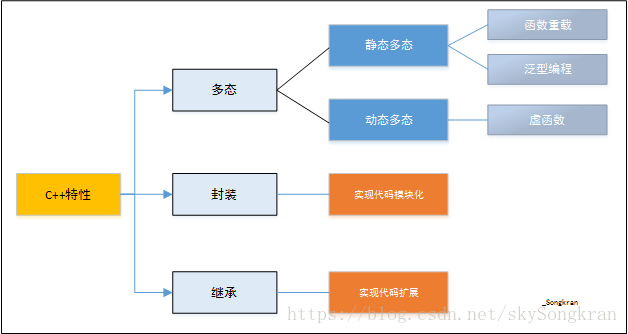
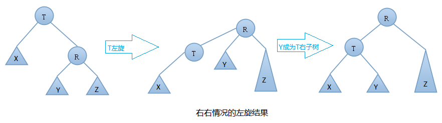
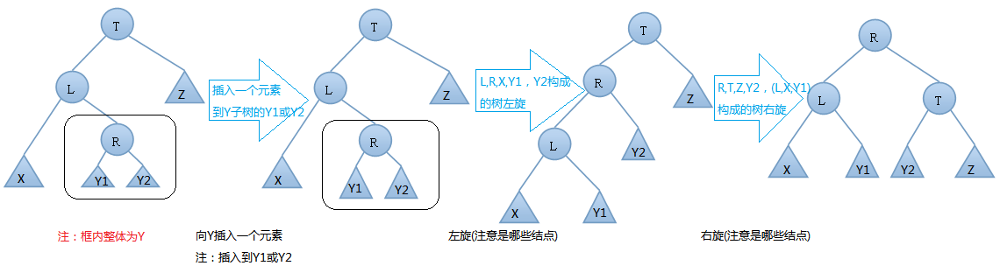
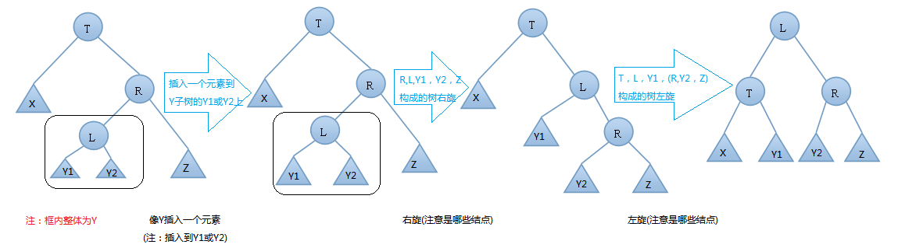
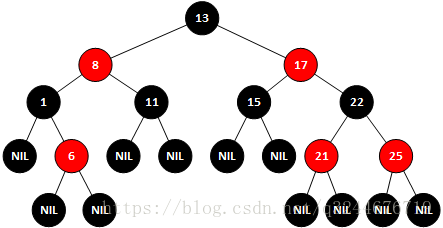
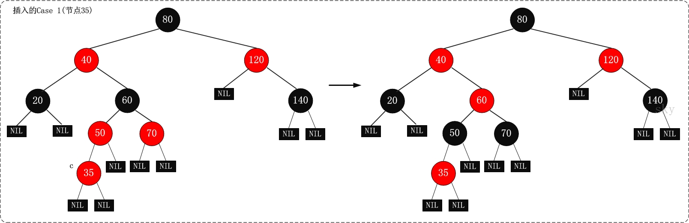
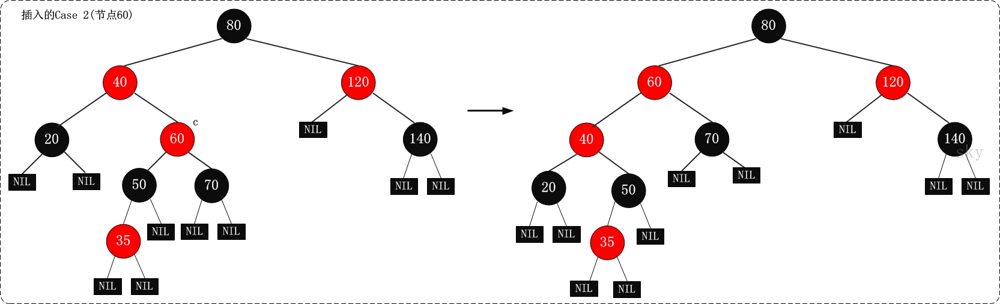

[TOC]

### const

#### 作用

1. **修饰变量**，说明该**变量不可以被改变**；
2. **修饰指针**，分为指向**常量的指针**和**指针常量**；
3. **常量引用**，经常用于**形参类型**，即避免了拷贝，又避免了函数对值的修改；
4. **修饰成员函数**，说明该**成员函数内不能修改成员变量**。

### static

#### 作用

1. 修饰**普通变量**，修改变量的**存储区域**和**生命周期**，使变量存储在**静态区**，在 main 函数运行前就分配了空间，如果有初始值就用**初始值初始化**它，如果没有初始值系统用默认值初始化它。
2. 修饰**普通函数**，表明**函数的作用范围（隐藏）**，仅在定义该函数的文件内才能使用。在多人开发项目时，为了**防止与他人命名空间里的函数重名**，可以将函数定位为 static。
3. 修饰成员变量，修饰成员变量使**所有的对象只保存一个该变量**，而且不需要生成对象就可以访问该成员。
4. 修饰成员函数，修饰成员函数使得**不需要生成对象就可以访问该函数**，但是在 static 函数内**不能访问非静态成员**。

### assert()

​	断言，是宏，而非函数，其作用是如果它的条件返回错误，则终止程序执行。

### union 联合

​	联合（union）是一种节省空间的特殊的类，一个 union 可以有多个数据成员，但是在任意时刻只有一个数据成员可以有值。当某个成员被赋值后其他成员变为未定义状态。

### friend 友元类和友元函数

- 能访问私有成员
- 破坏封装性
- 友元关系不可传递
- 友元关系的单向性
- 友元声明的形式及数量不受限制

### 面向对象

面向对象程序设计（Object-oriented programming，OOP）是种具有对象概念的程序编程典范，同时也是一种程序开发的抽象方针。



面向对象三大特征 —— 封装、继承、多态

### 封装

把客观事物封装成抽象的类，并且**类可以把自己的数据和方法只让可信的类或者对象操作**，对不可信的进行信息隐藏。关键字：public, protected, private。不写默认为 private。

- `public` 成员：可以被**任意实体**访问
- `protected` 成员：只允许被**子类及本类**的成员函数访问
- `private` 成员：只允许被**本类的成员**函数访问

### 继承

- 基类（父类）——> 派生类（子类）

### 多态

- 多态，即多种状态（形态）。简单来说，我们可以将多态定义为**消息以多种形式显示的能力**。
- **多态是以封装和继承为基础的**。
- C++ 多态分类及实现：
  1. **重载多态**（Ad-hoc Polymorphism，**编译期**）：**函数重载、运算符重载**
  2. **子类型多态**（Subtype Polymorphism，**运行期**）：**虚函数**
  3. **参数多态性**（Parametric Polymorphism，**编译期**）：**类模板、函数模板**
  4. **强制多态**（Coercion Polymorphism，**编译期/运行期**）：**基本类型转换、自定义类型转换**

#### 静态多态（编译期/早绑定）

函数重载

```c++
class A
{
public:
    void do(int a);
    void do(int a, int b);
};
```

#### 动态多态（运行期期/晚绑定）

- 虚函数：用 virtual 修饰成员函数，使其成为虚函数
- **动态多态：**它是在**程序运行时**根据基类的引用（指针）指向的对象来确定自己具体该调用哪一个类的虚函数

**注意：**

- 普通函数（非类成员函数）不能是虚函数
- 静态函数（static）不能是虚函数
- 构造函数不能是虚函数（因为在调用构造函数时，虚表指针并没有在对象的内存空间中，必须要构造函数调用完成后才会形成虚表指针）
- 基类中必须包含虚函数，并且派生类中一定要对基类中的虚函数进行**重写**
- 通过基类对象的指针或者引用调用虚函数

### 虚继承

虚继承用于解决多继承条件下的菱形继承问题（浪费存储空间、存在二义性）。

底层实现原理与编译器相关，一般通过**虚基类指针**和**虚基类表**实现，每个虚继承的子类都有一个虚基类指针（占用一个指针的存储空间，4字节）和虚基类表（不占用类对象的存储空间）

### 内存分配和管理

#### malloc、calloc、realloc、alloca

1. malloc：申请指定字节数的内存。申请到的内存中的**初始值不确定**。
2. calloc：为指定长度的对象，分配能容纳其指定个数的内存。申请到的内存的**每一位（bit）都初始化为 0**。
3. realloc：**更改以前分配的内存长度**（增加或减少）。当增加长度时，可能需将以前分配区的内容移到另一个足够大的区域，而**新增区域内的初始值则不确定**。
4. alloca：在栈上申请内存。程序在出栈的时候，会自动释放内存。

#### new、delete

1. new / new[]：完成两件事，先底层调用 malloc 分配了内存，然后调用构造函数（创建对象）。
2. delete/delete[]：也完成两件事，先调用析构函数（清理资源），然后底层调用 free 释放空间。
3. new 在申请内存时会自动计算所需字节数，而 malloc 则需我们自己输入申请内存空间的字节数。

### STL 容器

| 容器                                                         | 底层数据结构      | 时间复杂度                                                | 有无序 | 其他                                                         |
| ------------------------------------------------------------ | ----------------- | --------------------------------------------------------- | ------ | ------------------------------------------------------------ |
| [array](https://github.com/huihut/interview/tree/master/STL#array) | 数组              | 随机读改 O(1)                                             | 无序   | 支持快速随机访问                                             |
| [vector](https://github.com/huihut/interview/tree/master/STL#vector) | 数组              | 随机读改、尾部插入、尾部删除 O(1) 头部插入、头部删除 O(n) | 无序   | 支持快速随机访问                                             |
| [list](https://github.com/huihut/interview/tree/master/STL#list) | 双向链表          | 插入、删除 O(1) 随机读改 O(n)                             | 无序   | 支持快速增删                                                 |
| [deque](https://github.com/huihut/interview/tree/master/STL#deque) | 双端队列          | 头尾插入、头尾删除 O(1)                                   | 无序   | 一个中央控制器 + 多个缓冲区，支持首尾快速增删，支持随机访问  |
| [stack](https://github.com/huihut/interview/tree/master/STL#stack) | deque / list      | 顶部插入、顶部删除 O(1)                                   | 无序   | deque 或 list 封闭头端开口，不用 vector 的原因应该是容量大小有限制，扩容耗时 |
| [queue](https://github.com/huihut/interview/tree/master/STL#queue) | deque / list      | 尾部插入、头部删除 O(1)                                   | 无序   | deque 或 list 封闭头端开口，不用 vector 的原因应该是容量大小有限制，扩容耗时 |
| [priority_queue](https://github.com/huihut/interview/tree/master/STL#priority_queue) | vector + max-heap | 插入、删除 O(log2n)                                       | 有序   | vector容器+heap处理规则                                      |
| [set](https://github.com/huihut/interview/tree/master/STL#set) | 红黑树            | 插入、删除、查找 O(log2n)                                 | 有序   |                                                              |
| [multiset](https://github.com/huihut/interview/tree/master/STL#multiset) | 红黑树            | 插入、删除、查找 O(log2n)                                 | 有序   |                                                              |
| [map](https://github.com/huihut/interview/tree/master/STL#map) | 红黑树            | 插入、删除、查找 O(log2n)                                 | 有序   |                                                              |
| [multimap](https://github.com/huihut/interview/tree/master/STL#multimap) | 红黑树            | 插入、删除、查找 O(log2n)                                 | 有序   |                                                              |
| hash_set                                                     | 哈希表            | 插入、删除、查找 O(1) 最差 O(n)                           | 无序   |                                                              |
| hash_multiset                                                | 哈希表            | 插入、删除、查找 O(1) 最差 O(n)                           | 无序   |                                                              |
| hash_map                                                     | 哈希表            | 插入、删除、查找 O(1) 最差 O(n)                           | 无序   |                                                              |
| hash_multimap                                                | 哈希表            | 插入、删除、查找 O(1) 最差 O(n)                           | 无序   |                                                              |

### 二叉树

#### 遍历方式

- 先序遍历 根左右
- 中序遍历 左根右
- 后续遍历 左右根
- 层次遍历

#### 分类

- 满二叉树

- 完全二叉树（堆）

  - 大顶堆：根 >= 左 && 根 >= 右
  - 小顶堆：根 <= 左 && 根 <= 右

- 二叉查找树（二叉排序树）：左 < 根 < 右

- 平衡二叉树（AVL树）：| 左子树树高 - 右子树树高 | <= 1

- 最小失衡树（调整AVL树）：平衡二叉树插入新结点导致失衡的子树：

  - LL型：根的左孩子右旋

    

  - RR型：根的右孩子左旋

    

  - LR型：左孩子左旋，再右旋

    

  - RL型：右孩子右旋，再左旋

    

#### 红黑树

##### 红黑树的特征是什么？

1. 节点是红色或黑色。
2. 根是黑色。
3. 所有叶子都是黑色（叶子是 NIL 节点）。
4. 每个红色节点必须有两个黑色的子节点。（从每个叶子到根的所有路径上不能有两个连续的红色节点。）（新增节点的父节点必须相同）
5. 从任一节点到其每个叶子的所有简单路径都包含相同数目的黑色节点。（新增节点必须为红）



##### 调整

1. 变色
2. 左旋
3. 右旋

|        | **现象说明**                         | **处理策略**                                                 |
| ------ | ------------------------------------ | :----------------------------------------------------------- |
| Case 1 | 父节点红，叔叔节点红                 | (01) 将“父节点”设为黑色<br />(02) 将“叔叔节点”设为黑色<br />(03) 将“祖父节点”设为“红色” <br />(04) 将“祖父节点”设为“当前节点”<br />(05) 之后继续对“当前节点”进行操作。 |
| Case 2 | 父节点红，叔叔节点黑，该节点为右孩子 | (01) 将“父节点”作为“新的当前节点”<br />(02) 以“新的当前节点”为支点进行左旋。 |
| Case 3 | 父节点红，叔叔节点黑，该节点为左孩子 | (01) 将“父节点”设为“黑色” <br />(02) 将“祖父节点”设为“红色” <br />(03) 以“祖父节点”为支点进行右旋。 |

Case1 **叔叔是红色**



Case2 **叔叔是黑色，且当前节点是右孩子**



Case3 **叔叔是黑色，且当前节点是左孩子**


##### 红黑树、B 树、B+ 树的区别？

- 红黑树的深度比较大，而 B 树和 B+ 树的深度则相对要小一些
- B+ 树则将数据都保存在叶子节点，同时通过链表的形式将他们连接在一起。

#### B 树（B-tree）、B+ 树（B+-tree）


##### 应用

- 大部分文件系统、数据库系统都采用B树、B+树作为索引结构

##### B树的优点

对于在内部节点的数据，可直接得到，不必根据叶子节点来定位。

##### B+树的优点

- 非叶子节点不会带上 ROWID，这样，一个块中可以容纳更多的索引项，一是可以降低树的高度。二是一个内部节点可以定位更多的叶子节点。
- 叶子节点之间通过指针来连接，范围扫描将十分简单，而对于B树来说，则需要在叶子节点和内部节点不停的往返移动。

### 排序

| 排序算法                                                     | 平均时间复杂度 | 最差时间复杂度 | 空间复杂度 | 数据对象稳定性       |
| ------------------------------------------------------------ | -------------- | -------------- | ---------- | -------------------- |
| [冒泡排序](https://github.com/huihut/interview/blob/master/Algorithm/BubbleSort.h) | O(n2)          | O(n2)          | O(1)       | 稳定                 |
| [选择排序](https://github.com/huihut/interview/blob/master/Algorithm/SelectionSort.h) | O(n2)          | O(n2)          | O(1)       | 数组不稳定、链表稳定 |
| [插入排序](https://github.com/huihut/interview/blob/master/Algorithm/InsertSort.h) | O(n2)          | O(n2)          | O(1)       | 稳定                 |
| [快速排序](https://github.com/huihut/interview/blob/master/Algorithm/QuickSort.h) | O(n*log2n)     | O(n2)          | O(log2n)   | 不稳定               |
| [堆排序](https://github.com/huihut/interview/blob/master/Algorithm/HeapSort.cpp) | O(n*log2n)     | O(n*log2n)     | O(1)       | 不稳定               |
| [归并排序](https://github.com/huihut/interview/blob/master/Algorithm/MergeSort.h) | O(n*log2n)     | O(n*log2n)     | O(n)       | 稳定                 |
| [希尔排序](https://github.com/huihut/interview/blob/master/Algorithm/ShellSort.h) | O(n*log2n)     | O(n2)          | O(1)       | 不稳定               |
| [计数排序](https://github.com/huihut/interview/blob/master/Algorithm/CountSort.cpp) | O(n+m)         | O(n+m)         | O(n+m)     | 稳定                 |
| [桶排序](https://github.com/huihut/interview/blob/master/Algorithm/BucketSort.cpp) | O(n)           | O(n)           | O(m)       | 稳定                 |
| [基数排序](https://github.com/huihut/interview/blob/master/Algorithm/RadixSort.h) | O(k*n)         | O(n2)          |            | 稳定                 |